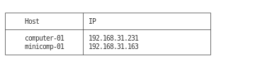

# capp_broadcast_detector

Клиент-серверное приложение для отслеживания ip машин в локальной сети и время работы и подключения.



## Запуск

На удаленном сервере и на локальном сервере

```
./capp_broadcast_detector server
```

На локальной машине там же, где запущен один из серверов

```
./capp_broadcast_detector client
```